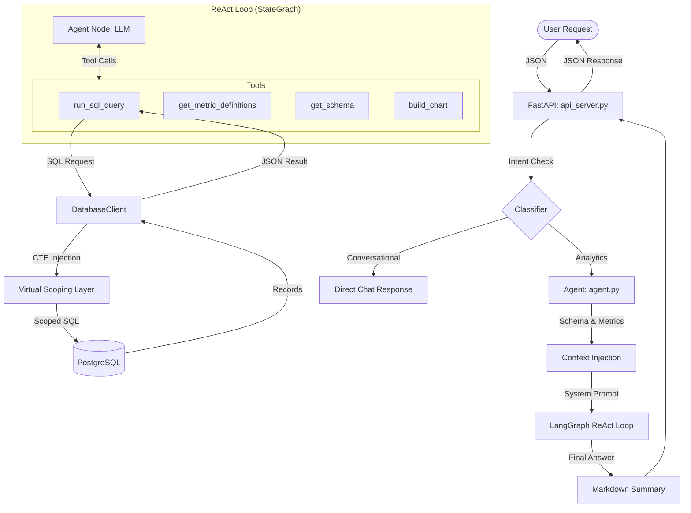
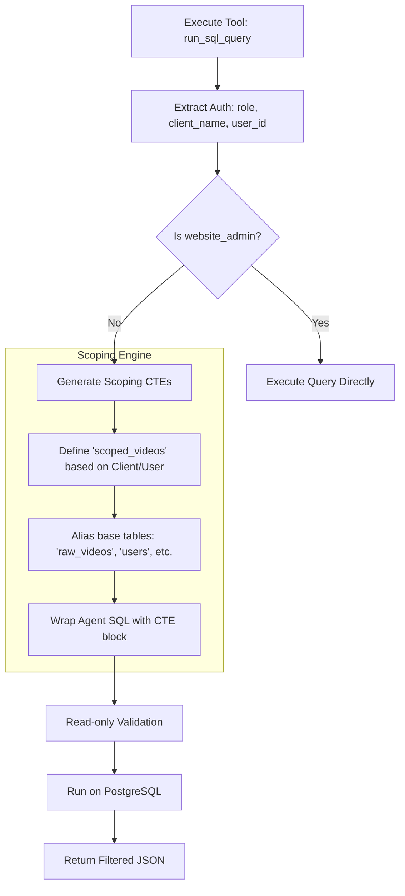

# Agent Architecture & Database Partitioning Analysis

This document outlines the current state of the Frammer Analytics Agent, its data flow, and the underlying database partitioning (scoping) mechanism.

## 1. Agent Flow & Data Movement

The agent operates as a **ReAct (Reasoning + Acting)** system built with **LangGraph** and powered by **Anthropic Claude 3 Haiku**.

### Agent Workflow Diagram

### Data Flow Keys
- **Input**: Natural language questions (standard or filtered).
- **Context**: Dynamic injection of database schema, business metrics, and conversation memory.
- **Security**: Proactive injection of `WITH` clauses (CTEs) to ensure tenant isolation.
- **Output**: Markdown summaries, SQL queries (internal), and Plotly chart XML.

---

## 2. Database Partitioning Research

### Current State: Virtual Scoping (CTEs)
Research confirms that the database does **not** use physical partitioning (e.g., `PARTITION BY`). Instead, it employs **Virtual Partitioning** at the application layer through **Proactive Scoping**.

### Procedural Flowchart: Data Scoping Logic

### Assumption Verification
| Assumption | Reality | Status |
| :--- | :--- | :--- |
| **Physical Partitioning** | None found in schema. | ❌ Not Followed |
| **Database-Level RLS** | RLS is disabled (`SET row_security = off`). | ❌ Not Followed |
| **CTE-Based Scoping** | Active and enforced in [mcp_server/database.py](file:///c:/Users/kmzpa/Desktop/asdfghjkl/gcdata/agent/mcp_server/database.py). | ✅ Followed |
| **PostgreSQL Usage** | Confirmed PostgreSQL is the primary store. | ✅ Followed |

> [!WARNING]
> **Security Gap Identified**: The current implementation relies on **CTE Injection** in the Python layer. Previous project goals suggested a move to **PostgreSQL Row-Level Security (RLS)** for robustness, but the code shows this transition is incomplete or reverted.

---

## 3. Implementation Details

- **Database Client**: [mcp_server/database.py](file:///c:/Users/kmzpa/Desktop/asdfghjkl/gcdata/agent/mcp_server/database.py) contains the logic that intercepts SQL queries and prepends the scoping block.
- **Agent Loop**: [agent/agent.py](file:///c:/Users/kmzpa/Desktop/asdfghjkl/gcdata/agent/agent.py) manages the recursion and tool sequencing.
- **MCP Server**: Infrastructure used to bridge the LLM with database tools.
