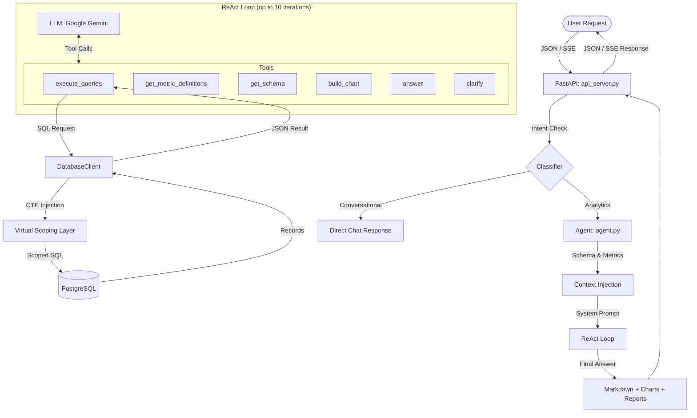
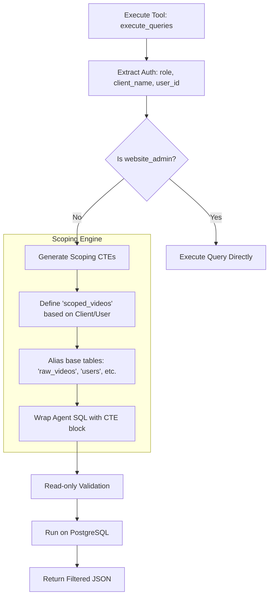

# Agent Architecture & Database Partitioning Analysis

This document outlines the current state of ATLAS, its data flow, and the underlying database partitioning (scoping) mechanism.

## 1. Agent Flow & Data Movement

The agent operates as a **ReAct (Reasoning + Acting)** system built directly on **Google's `google-genai` SDK** with zero framework dependencies (no LangChain, no LangGraph).

### Agent Workflow Diagram

### Data Flow Keys
- **Input**: Natural language questions (standard or filtered).
- **Context**: Dynamic injection of database schema, business metrics, and conversation memory.
- **Security**: Proactive injection of `WITH` clauses (CTEs) to ensure tenant isolation.
- **Output**: Markdown summaries, interactive chart XML dashboards, and HTML reports.

---

## 2. Database Partitioning Research

### Current State: Virtual Scoping (CTEs)
The database does **not** use physical partitioning (e.g., `PARTITION BY`). Instead, it employs **Virtual Partitioning** at the application layer through **Proactive Scoping**.

### Procedural Flowchart: Data Scoping Logic

### Assumption Verification
| Assumption | Reality | Status |
| :--- | :--- | :--- |
| **Physical Partitioning** | None found in schema. | Not used |
| **Database-Level RLS** | RLS is disabled (`SET row_security = off`). | Not used |
| **CTE-Based Scoping** | Active and enforced in `agent/mcp_server/database.py` and `backend/queries/analytics_shared.py`. | Active |
| **PostgreSQL Usage** | Confirmed PostgreSQL 16 is the primary store. | Active |

> **Note**: The implementation relies on CTE injection in the Python layer rather than PostgreSQL Row-Level Security (RLS). This approach is enforced in both the agent's `DatabaseClient` and the backend's query builders via shared scoping CTEs (`scoped_videos`, `scoped_assets`, `scoped_posts`).

---

## 3. Implementation Details

- **Agent Database Client**: `agent/mcp_server/database.py` — intercepts SQL queries and prepends auth-scoped CTE blocks.
- **Backend Query Builders**: `backend/queries/analytics_shared.py` — applies the same scoping pattern for deterministic API endpoints.
- **Agent Loop**: `agent/agent.py` — manages the ReAct iteration loop and tool dispatch.
- **MCP Server**: Infrastructure bridging the LLM with database tools via FastMCP.
- **Auth Middleware**: `backend/middleware/auth.py` — extracts JWT claims and provides auth context to both agent and backend queries.
